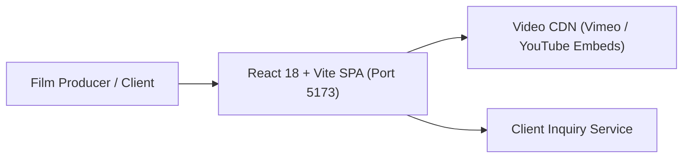
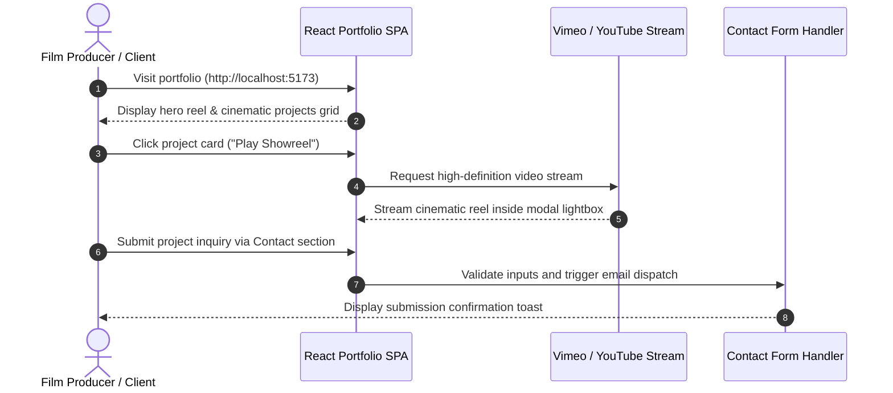

# Arjun Vasudev — Filmmaker & Director Portfolio

[]()
[]()
[]()

## Overview
A cinematic web portfolio designed for filmmaker, visual director, and cinematographer Arjun Vasudev. Built with React 18, Vite, and Tailwind CSS, it delivers a showcase of high-definition video reels, categorized filmographies, still photography galleries, and client contact channels.

## Features
- **Cinematic Showreel Modal:** High-definition video playback in a fluid modal lightbox.
- **Categorized Filmography:** Filter projects by Feature Films, Short Films, Commercials, and Documentaries.
- **Behind-the-Scenes Photo Gallery:** High-resolution photography lightbox.
- **Client Inquiry Flow:** Responsive contact form for booking inquiries and client communications.

## Architecture


## User Flow


## Technology Stack
| Layer | Technology | Purpose |
|---|---|---|
| Framework | React 18, Vite | Component-driven UI with instant HMR |
| Styling | Tailwind CSS | Cinema-grade dark aesthetic and responsive grid |
| Icons | Lucide React | Clean, scalable vector icons |
| Tooling | PostCSS, Autoprefixer | CSS processing and cross-browser support |

## Infrastructure
- **Development Port:** 5173
- **Hosting / CDN:** Vercel / Netlify / GitHub Pages
- **Asset Hosting:** Cloudinary / Vimeo Pro / YouTube

## Project Structure
```text
Arjun_portfolio/
├── src/
│   ├── assets/          # High-resolution stills and branding graphics
│   ├── components/      # FilmCard, VideoModal, Navbar, Hero, ContactForm
│   ├── data/            # Filmography and project metadata
│   ├── App.tsx          # Root application layout
│   └── main.tsx         # React DOM mount point
├── index.html           # HTML template
├── package.json         # Dependencies and build scripts
├── vite.config.ts       # Vite build configuration
├── .env.example         # Environment template
├── .gitignore           # Git ignore definitions
└── README.md            # Technical documentation
```

## Prerequisites
- Node.js >= 18.x
- npm >= 9.x

## Environment Variables
Copy `.env.example` to `.env` and configure placeholders:
```env
VITE_CONTACT_EMAIL=contact@arjunvasudev.com
VITE_VIMEO_CLIENT_ID=your_vimeo_id_optional
```

## Local Development Setup
1. Clone the repository:
   ```bash
   git clone https://github.com/Bhanutejanallamothu/Arjun_portfolio.git
   cd Arjun_portfolio
   ```
2. Install dependencies:
   ```bash
   npm install
   ```
3. Start development server:
   ```bash
   npm run dev
   ```
4. Open `http://localhost:5173` in your browser.

## Docker Setup
*Not detected in repository. Static SPA deployable to Nginx or static CDN.*

## Database Setup
*Not applicable. Portfolio content is statically driven via structured TypeScript data files.*

## API Documentation
*Client-side single-page application.*

## Deployment
Build static production bundle:
```bash
npm run build
```
Deploy the `dist/` directory to Vercel, Netlify, or Cloudflare Pages.

## Security
- Content Security Policy (CSP) compliant embed handling for video frames.
- Form input validation to prevent spam and injection attacks.

## Testing
Verify build:
```bash
npm run build
```

## Troubleshooting
- **Video Embeds Not Loading:** Verify internet connectivity and third-party iframe blocking in browser extensions.

## Future Improvements
- Headless CMS integration (Sanity.io) for live reel updates.
- Interactive behind-the-scenes timeline with interactive script excerpts.

## License
All rights reserved by Arjun Vasudev and repository owner.
